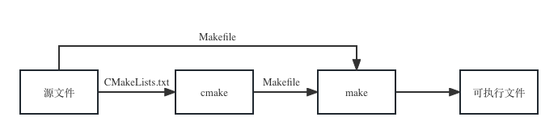
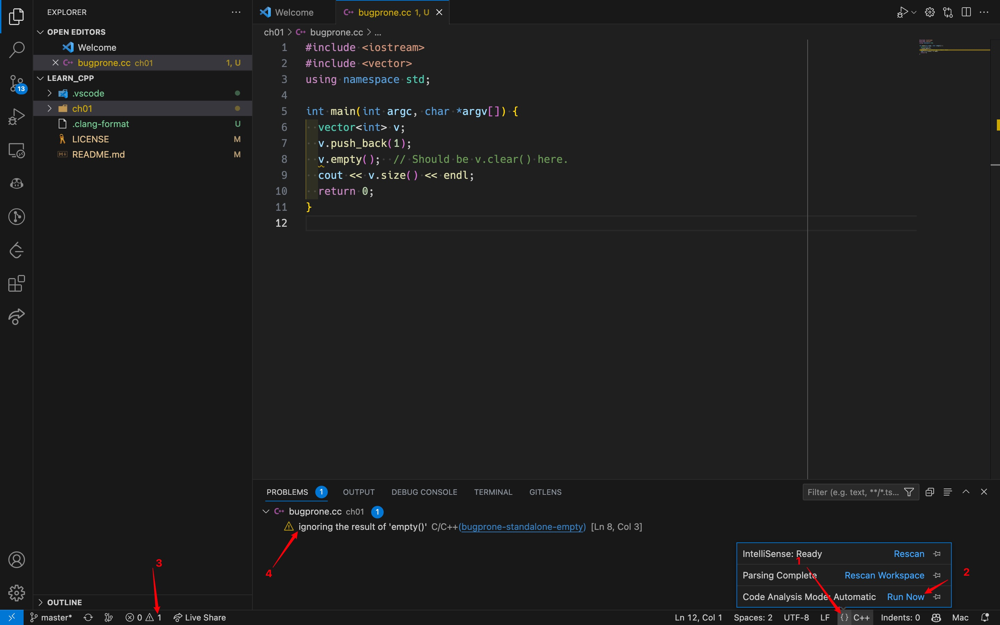

# C++ 开发环境搭建

## 1. 编辑器
编辑器可用于创建源文件，编写源代码， C++  源码通常使用后缀 .cpp 或者 .cc。常用的文本编辑器包括：

- Emacs
- Vim
- **Visual Studio Code**

### 插件：C/C++ Extension Pack

常用的 C++ 集成开发环境（IDE, Integrated Development Environment）有：

- Visual Studio：宇宙第一 IDE，但只能在 Windows 平台使用
- CLion：Jetbrains 系列之一，跨平台但无社区（免费）版

通过在编辑器中安装各种语言的插件包，可以将 VS Code 打造成对应的 IDE，C/C++ Extension Pack 包含以下插件（也可以单独安装）：

- C/C++
- C/C++ Themes
- CMake
- CMake Tools

C/C++ 插件安装路径：`~/.vscode/extensions/ms-vscode.cpptools-<version>-<platform>`

其他配置：

``` JSON
"editor.formatOnSave": true,  // 保存时自动格式化
"files.autoSave": "onFocusChange", // 鼠标离开时自动保存
"files.eol": "\n",  // 换行符设为 linux 格式的 \n
"files.insertFinalNewline": true,  // 文件最后自动加上空行
"files.trimTrailingWhitespace": true,  // 保存文件时删除行尾空格
```

## 2. C++ 编译器

国际 C++ 标准委员会每 3 年发布一次新标准，所谓现代 C++ (Modern C++) 指的是 C++11 及之后的版本。相比较于 C++98/03，C++11 是 C++ 语言发展史上的一个里程碑版本（变化较大，更像一门新语言）。
C++ 编译器将人类可读的 C++ 源代码，按照 C/C++ 标准，"编译"成 CPU 可读和执行的机器语言。

常用的 C++ 编译器有：

- 微软的 MSVC（Visual Studio 中自带）
- LLVM 的 Clang/Clang++
- **GNU 的 GCC/G++**

## 3. 跨平台自动化构建系统

单个 C++ 源文件的编译比较简单，只需要在 shell 中调用两行命令即可完成程序的编译和运行：

``` C++
#include <iostream>
using namespace std;

int main(int argc, char *argv[]) {
  cout << "Hello, World!" << endl;
  return 0;
}
```

``` Bash
$ g++ main.cc -o main
$ ./main
Hello, World!
```

#### Make

大型软件的编译和维护是一个复杂而耗时的过程，涉及到大量的文件、目录。开发过程中当修改了少量几个文件后，往往只需要重新编译、生成少数几个文件。Makefile 可以有效地描述这些文件之间的依赖关系以及处理命令，当个别文件改动后仅执行必要的处理，而不必重复整个编译过程（增量式编译），大大提高软件开发的效率。

**Makefile 中的缩进需要使用 Tab 而不是空格！**

``` Makefile
.PHONY: all
all: main.cc
	g++ main.cc -o main
```

``` Bash
$ make
$ ./main
Hello, World!
```

通用 Makefile 模板：https://gist.github.com/pengzhendong/4c953c58b3110f6751e927b3a2a6529d

### CMake

CMake 是针对跨平台编译问题，所设计的工具：它首先允许开发者编写一种平台无关的 CMakeLists.txt 文件来定制整个编译流程，然后再根据目标用户的平台进一步自动生成所需的本地化 Makefile 和工程文件，如 Unix 的 Makefile 或 Windows 的 Visual Studio 工程。



``` CMake
add_executable(main main.cc)
```

``` Bash
$ cmake -B build
$ cmake --build build
$ ./build/main
Hello, World!
```

## 4. Google Style

每个较大的开源项目都有自己的风格指南：关于如何为该项目编写代码的一系列约定。

“风格”的含义涵盖范围广，从变量使用驼峰格式到决不使用全局变量再到决不使用异常，等等诸如此类。

### clang-format

clang-format 能够自动化格式 C/C++ 代码，支持多种代码风格：Google 和 LLVM 等等（也支持编写 .clang-format 文件自定义风格）。

VS Code 中的 C/C++ 插件集成了 clang-format：`~/.vscode/extensions/ms-vscode.cpptools-<version>-<platform>/LLVM/bin/clang-format`。

VS Code 中的配置项 C_Cpp.clang_format_path 参数可以配置默认的 clang-format 路径。

### 代码格式化

clang-format 会根据当前目录下的 .clang-format 文件中的风格，对代码进行格式化。如果当前目录下找不到 .clang-format 文件，会一直往上级目录搜索。如果均无法找到 .clang-format 文件，则使用默认风格对代码进行格式化。

``` Bash
$ clang-format -style=google -dump-config > .clang-format
$ clang-format -style=google -i main.cc
$ clang-format -style=file -i main.cc
```

## 5. 静态分析

常用的 C++ 静态分析工具有：

- [cpplint](https://github.com/cpplint/cpplint)：基于正则表达式，易误判，支持单个文件和整个项目，主要检查项：
  - 代码风格（空格、缩进、命名约定等）
  - 非必要的类型转换
  - 指针操作是否正确
- [clang-tidy](https://clang.llvm.org/extra/clang-tidy): 基于语法分析树，慢、准、全，支持在 CMakeLists.txt 中配置，主要[检查项](https://clang.llvm.org/extra/clang-tidy/checks/list.html)：
  - 内存相关问题：如内存泄漏、使用已释放的内存等等
  - 代码风格：如 [google-explicit-constructor](https://clang.llvm.org/extra/clang-tidy/checks/google/explicit-constructor.html) 要求单个参数的构造函数需要用 `explicit` 关键字避免隐式类型转换
  - 提倡把 C++03 代码转换成 C++11：如 [modernize-use-nullptr](https://clang.llvm.org/extra/clang-tidy/checks/modernize/use-nullptr.html) 用 `nullptr` 替换 `NULL`
  - 检查容易出错的代码结构：如 [bugprone-standalone-empty](https://clang.llvm.org/extra/clang-tidy/checks/bugprone/standalone-empty.html)，当调用容器的 `empty()` 函数却忽略返回值时，会提示用户是否想用的是 `clear()` 函数

clang-tidy 跟 clang-format一样，集成在 VS Code 中的 C/C++ 插件中：`~/.vscode/extensions/ms-vscode.cpptools-<version>-<platform>/LLVM/bin/clang-tidy`。

### clang-tidy 检查项配置

``` Bash
$ clang-tidy --list-checks -checks='*'
$ clang-tidy -checks="bugprone-*" -dump-config > .clang-tidy
```

clang-tidy 的检查项可以在 .clang-tidy 文件中设置：

``` Yaml
---
Checks: 'bugprone-standalone-empty'
...
```

也可以在 vscode 的配置中设置：

``` JSON
"C_Cpp.codeAnalysis.clangTidy.enabled": true,
 "C_Cpp.codeAnalysis.clangTidy.checks.enabled": [
   "bugprone-standalone-empty"
 ],
```

``` C++
#include <iostream>
#include <vector>
using namespace std;

int main(int argc, char *argv[]) {
  vector<int> v;
  v.push_back(1);
  v.empty();  // Should be v.clear() here.
  cout << v.size() << endl;
  return 0;
}
```


